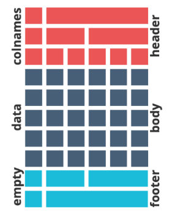

# Loading Packages

```{r}
#| label: setup
#| include: false

if (!("ggplot2" %in% installed.packages()[,"Package"])) install.packages("ggplot2")
if (!("dplyr" %in% installed.packages()[,"Package"])) install.packages("dplyr")
if (!("tidyr" %in% installed.packages()[,"Package"])) install.packages("tidyr")
if (!("flextable" %in% installed.packages()[,"Package"])) install.packages("flextable")

library(ggplot2)
library(dplyr)
library(tidyr)
library(flextable)
```

# Introduction

`flextable` is an R package that lets you customize tables in documents
beyond what base R has to offer. The vast amount of customization allows
you to create tables that you can use for reports, publications, and
more.

If you check the yaml header at the top of this document, you can notice
that we are using the `word_document` output format. This means that the
output of this markdown document will be rendered into a Word document,
rather than an HTML file. Although We focus on creating tables in Word
documents, `flextable` also supports HTML and PowerPoint.

In this workshop, we will use `flextable` to:

-   Create table in a word document

-   Add headers and footers

-   Change text formatting inside the table

-   Merge cells

We will use `iris` and the `diamonds` data set from the `ggplot2`
package for examples and exercises.

```{r}
head(iris)
head(diamonds)
```

# Basics

The main function is `flextable()`, which takes a `data.frame` as an
argument and outputs a `flextable` object.

```{r}
# Create a flextable object using first 6 rows of the iris dataset
ft <- flextable(head(iris))

# print what type of object ft is
class(ft)
```

If you are in an interactive session using R Studio or R GUI, printing
the table will display the table in the viewer.

```{r}
ft
```

**You can also render the table in a Word document** by using the
`preview = "docx"` argument in the `print()` function. This way you can
quickly see what the table would look like inside a word document.

```{r}
print(ft, preview = "docx")
```

The cell width for header doesn't look too great... let's not worry
about that for now. That's an aspect of the table that can be
customized.

Before we go on further, **let's decide on the default format** we would
like to apply for all our subsequent tables using the
`set_flextable_defaults()` function. You can call this function once
(usually in the beginning of your script or first code chunk in R
markdown) with the style you would like to apply for all the tables
unless a different formatting is specified for a specific table.

```{r}
init_flextable_defaults()
set_flextable_defaults(
  font.size = 12, font.family = "Arial", color = "black",
  table.layout = "autofit", background.color = "beige"
)
```

Now let's try creating the table again.

```{r}
mydf_flex <- flextable(head(iris))
print(mydf_flex, preview = "docx")
```

There are many more parameters available for styling the table, which is
documented in the help file, accessible by running
`?set_flextable_defaults`. Other parameters include: `border.color`,
`border.width`, `background.color`, `decimal.mark`, `digits`.

To revert back to the original package default settings, you can run
`init_flextable_defaults()`.

```{r}
init_flextable_defaults()
```

### Exercise 1

For this exercise, I would like you to create and display a `flextable`
for the first 50 rows of the `diamonds` dataset. Render the output in a
word document.

Also, apply the following default style:

-   font size to 10

-   background color to `"paleturquoise1"`

-   use comma for decimal digits (`decimal.mark`)

-   use period for the "thousands separator" (argument name for this is
    `big.mark`)

NOTE: you will get a warning message about `big.mark` and
`decimal.mark`. You can ignore this warning for this exercise.

```{r}
# type your answer here

```

# Table Design

Let's first set the default style for the rest of this workshop.

```{r}
init_flextable_defaults()

set_flextable_defaults(
  font.size = 12, font.family = "Arial", color = "black",
  padding = 3, line_spacing = 1.2, table.layout = "autofit"
)
```

There are 3 parts to the `flextable` object: the header, the body, and
the footer.

{width="262"}

-   **Header** only contains the column names by default but you can add
    information by adding more "rows"

-   **Body** contains the data

-   **Footer** is empty by default, but you can manually add more
    information to the footer

## Header and Footer

For selecting and reordering columns, specify the column names in the
`col_keys=` argument in the `flextable()` function.

```{r}
diamonds_ft <- diamonds %>% 
  # select first 10 rows
  head(10) %>%
  # create flextable object, select and reorder columns
  flextable(
    col_keys = c("price", "carat","cut","color","clarity","x","y","z"),
  )
print(diamonds_ft)
```

There are four functions for adding header and footer:

-   `add_header_row`, `add_header_lines`

-   `add_footer_row`, `add_footer_lines`

You can choose which columns to merge with `add_*_row` functions whereas
`add_*_lines` merges all columns

Arguments for the functions:

-   `top=` argument decides whether the new header is added to the top
    or bottom of the existing header. Header / footer is added to the
    top by default.

-   `values=` argument specifies the text you would like to display in
    the header

-   `colwidths=` specifies how many columns you would like each value to
    occupy. This feature allows the header to span across multiple
    columns.

NOTE: when working with `flextable`, you can chain the changes to the
`flextable` (using `flextable` functions) by piping (either using `%>%`
or `|>`).

In the following code, I add a new header on top of columns for price,
the 4 C's, and the dimension.

```{r}
diamonds_ft <- diamonds_ft %>%
  # add header
  add_header_row(
    values = c("Price","4 C's", "Dimension"),
    colwidths = c(1,4,3)
  ) %>%
  # add header that merges all columns
  add_header_lines(
    values = "Diamond dataset"
  )
diamonds_ft
```

Lets continue with this table and add a footer.

```{r}
diamonds_ft <- diamonds_ft %>%
  # add footer
  add_footer_lines(values = "First 10 rows of the diamonds dataset from ggplot2 package.")
diamonds_ft
```

### Exercise 2

I created a summary of the iris dataset and saved into a variable
`iris_summary`. Using this data frame:

-   create a `flextable` with a new header row at the top with three
    cells that says "Species", "Variable", "Descriptive Statistic" that
    spans over 1, 2, and 4 columns respectively.

-   add another header at the top that says "Iris Dataset Summary". This
    header should merge all columns!

-   add a footer that says "Table created using flextable package in R"

```{r}
# run this cell first!
iris_summary <- iris %>%
  group_by(Species) %>%
  summarise(
      across(
          everything(),
          list(Mean = mean, `Stddev` = sd,
               Median = median, IQR = IQR
          )
      )
  ) %>%
  pivot_longer(
    cols = contains("_"),
    names_to = c("part", "measurement", ".value"),
    names_pattern = "^(\\w+)\\.(\\w+)_(\\w+)"
  )
```

```{r}
# type your answer here

```

## Formatting Elements in a Table

Let's take a look at the `diamonds_ft`:

```{r}
diamonds_ft
```

There are several things I don't like with this table. The headers
aren't aligned. It's difficult to tell which cells are merged in the
header. I'd like to bold the header and make footer smaller. Fortunately
`flextable` lets us control these properties. This customization can be
applied to header, footer, and body of the table.

Some of the functions include `bg()`, `bold()`, `hline()`, `vline()`,
`color()`, `padding()`, `fontsize()`, `italic()`, `align()`.

These functions share a common syntax, which can be split into four
parts:

1.  `flextable` object that you would like to edit
2.  **Selector**, which corresponds to `i=` and `j=` arguments. This
    helps `flextable` identify which specific cell to edit
3.  **Part** identifier, which tells `flextable` which part of the table
    to edit (can be `"header"`, `"footer"`, `"body"`, or `"all"`
4.  **Function-specific arguments**

Suppose we would like to **center and bold** all the headers. We can use
the `align()` and `bold()` function on the table.

```{r}
diamonds_ft <- diamonds_ft %>%
  # align header to center
  align(align = "center", part = "header") %>%
  # bold header
  bold(part = "header") %>%
  # set fontsize for footer
  fontsize(size = 8, part = "footer")
diamonds_ft
```

### Selectors

Selectors `i=` and `j=` are used for selecting rows and columns,
respectively. There are several ways to express the selection. We will
focus on two ways: as integers and formula.

#### Integer Based Selection

You can use integers as an index of the cell for which you would like to
select.

```{r}
diamonds_ft %>%
  # highlight entire first row of the body
  bg(i = 1, bg = "skyblue", part = "body") %>%
  # highlight third row third column of the body
  bg(i = c(6,7,8), j = 3, bg = "skyblue", part = "body") %>%
  # remember you can also change header properties as well.
  # the index goes from top to bottom
  bg(i = 1, bg = "skyblue3", part = "header")
```

#### Formula Based Selection

With formula based selection, you can write an expression using the
column names that can be evaluated to `TRUE` or `FALSE` to select the
rows. The syntax begins with `~` and then an R expression. This lets you
conveniently format certain cells depending on their values in an
automated fashion.

For selecting columns, you can follow similar syntax by writing the
column name, and using `+` to select multiple columns.

```{r}
diamonds_ft <- diamonds_ft %>%
  # bold and color cuts and price that are "Ideal" or "Premium"
  bold(i = ~ cut %in% c("Ideal", "Premium"), j = ~ cut + price) %>%
  color(i = ~ cut %in% c("Ideal", "Premium"), j = ~ cut, color = "skyblue4") %>%
  color(i = ~ cut %in% c("Ideal", "Premium"), j = ~ price, color = "forestgreen")
diamonds_ft
```

### Adding and Customizing Borders / Lines

You can also add and customize lines and borders for your table. You
have a lot of options when it comes to which function to use (use
`?border` to check them out!). In this example, we will use `vline` to
add some vertical lines. By using `vline` and selectors, we can select
where to add vertical lines. `vline` will add a vertical line to the
right of the specified column.

```{r}
diamonds_ft %>%
  # add vertical lines to the body
  vline(j = c(1, 5), part = "body") %>%
  # add vertical lines to the second and third header (counting from the top)
  vline(i = c(2, 3), j = c(1, 5), part = "header")
```

**NOTE**: Merged cells behave slightly weird when using selectors.
Generally you should use the first column (or row if rows are merged) of
the merged cells when referring to the merged cell.

### Exercise 3

The following `flextable` is a similar to the resulting table from
exercise 2. Now, try to apply what we learned previously to make the
following changes:

-   Bold & center all the headers (`bold`, `align`)

-   color the words "setosa", "versicolor", "virginica" with
    "violetred", "steelblue", "purple", respectively (`color`)

-   add vertical line after first and third column (`vline`)

-   bonus: add horizontal line below last entries of "setosa" and
    "versicolor" (`hline`)

```{r}
# run this cell first!
iris_summary <- iris %>%
  group_by(Species) %>%
  summarise(
      across(
          everything(),
          list(Mean = mean, `Stddev` = sd,
               Median = median, IQR = IQR
          )
      )
  ) %>%
  pivot_longer(
    cols = contains("_"),
    names_to = c("part", "measurement", ".value"),
    names_pattern = "^(\\w+)\\.(\\w+)_(\\w+)"
  ) %>%
  flextable() %>%
  add_header_row(values = c("Species", "Variable", "Descriptive Statistic"), colwidths = c(1,2,4)) %>%
  add_header_lines("Iris Dataset Summary") %>%
  add_footer_lines("Table created using flextable package")
```

```{r}
# type your answer here

```

## Merging Cells

There are many options when it comes to merging cells. You can choose to
merge cells vertically or horizontally if they share the same values, or
merge cells based on a range. We will take a look at the first option.
To merge cells with same values vertically, use `merge_v`.

```{r}
diamonds_summary <- diamonds %>%
  filter(carat < 1, clarity >= "VS2") %>%
  mutate(
    color = case_when(
      color %in% c("D","E") ~ color,
      .default = "<= F"
      ),
    color = factor(color, c("D", "E", "<= F"))
  ) %>%
  group_by(cut, color) %>%
  summarise(average_price = mean(price), .groups = "drop") %>%
  flextable() %>%
  bold(part = "header")
print(diamonds_summary)
```

Let's try merging vertically based on common values in the first column.
I've added some horizontal lines to make the separation more apparent.

```{r}
diamonds_summary <- diamonds_summary %>%
  merge_v(j = 1) %>%
  hline(i = c(3,6,9,12))
print(diamonds_summary)
```

Notice that the bottom border looks off... It turns out that when
merging, the border will take on the property of the first cell among
the merged cells. You can use `fix_border_issues()` function to fix this
issue.

```{r}
diamonds_summary %>%
  fix_border_issues()
```

### Exercise 4

Following code saves the output from previous exercise into
`iris_summary`. Merge vertically for first and second columns across
common cells. Also, try rendering the output into a word document.

```{r}
# run this cell first!
iris_summary <- iris %>%
  group_by(Species) %>%
  summarise(
      across(
          everything(),
          list(Mean = mean, `Stddev` = sd,
               Median = median, IQR = IQR
          )
      )
  ) %>%
  pivot_longer(
    cols = contains("_"),
    names_to = c("part", "measurement", ".value"),
    names_pattern = "^(\\w+)\\.(\\w+)_(\\w+)"
  ) %>%
  flextable() %>%
  add_header_row(values = c("Species", "Variable", "Descriptive Statistic"), colwidths = c(1,2,4)) %>%
  add_header_lines("Iris Dataset Summary") %>%
  add_footer_lines("Table created using flextable package") %>%
  bold(part = "header") %>%
  align(part = "header", align = "center") %>%
  vline(j = c(1,3), part = "body") %>%
  vline(j = c(1,3), part = "header") %>%
  color(i = ~ Species == "setosa", j = ~Species, color = "violetred") %>%
  color(i = ~ Species == "versicolor", j = ~Species, color = "steelblue") %>%
  color(i = ~ Species == "virginica", j = ~Species, color = "purple") %>%
  hline(i = c(4, 8))
```

```{r}
# type your answer here
```

# Conclusion

`flextable` is a powerful package for creating customized tables in an
automated fashion. One big advantage is that once you have the code for
creating a table, even if your data changes, you don't have to go back
to the table and change the numbers manually.

There is a lot of features that we have not covered today that can
change the way you display your data. For example, you can also embed
images and certain plots to the table. I added additional resources in
the next section for you to check out if you are interested in using
this package.

# Resources

A comprehensive resource guide for `flextable` can be found
[here](https://ardata-fr.github.io/flextable-book/index.html).

Another great resource to check out is this
[gallery](https://ardata.fr/en/flextable-gallery/), where you can see
examples of tables created with `flextable`.
